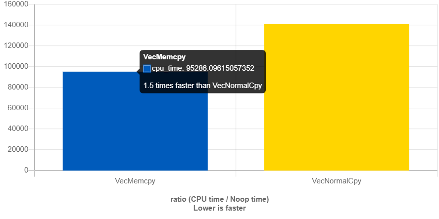

# Copy Benchmark for assimp data transfer

A minimal workflow imitation : 

```c++
#include <vector>
#include <cstring>

struct Vec
{
  float x;
  float y;
  float z;
};

struct Assembly
{
  Vec a;
  Vec b;
  Vec c;
};

const int size = 10000;
std::vector<Vec> asA(size);
std::vector<Vec> asB(size);
std::vector<Vec> asC(size);

std::vector<Assembly> asAs(size);

static void VecMemcpy(benchmark::State& state)
{
  for(auto _ : state)
  {
    for(int i = 0; i < size; i++)
    {
      memcpy(&(asAs[i].a), &(asA[i]), sizeof(Vec));
      memcpy(&(asAs[i].b), &(asB[i]), sizeof(Vec));
      memcpy(&(asAs[i].c), &(asC[i]), sizeof(Vec));
    }
  }
  return;
}

static void VecNormalCpy(benchmark::State& state)
{
  for(auto _ : state)
  {
    for(int i = 0; i < size; i++)
    {
      asAs[i].a.x = asA[i].x;
      asAs[i].a.y = asA[i].y;
      asAs[i].a.z = asA[i].z;
      
      asAs[i].b.x = asB[i].x;
      asAs[i].b.y = asB[i].y;
      asAs[i].b.z = asB[i].z;

      asAs[i].c.x = asC[i].x;
      asAs[i].c.y = asC[i].y;
      asAs[i].c.z = asC[i].z;
    }
  }
  return;
}

BENCHMARK(VecMemcpy);
BENCHMARK(VecNormalCpy);
```

gcc 11.2:



clang 13.0:


So it's undetermined which one is faster, thus we decide not to use memcpy considering code complexity.