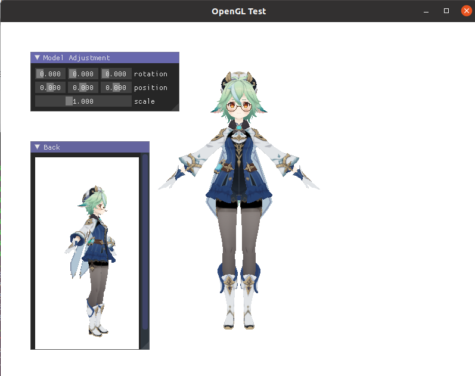

# README

In simple scenes, most of the code we write in OpenGL is drab and dreary and basically needs no or only slight changes. It's also quite a painful course to install dependencies. OpenGLFramework is a clean and easy-to-use wrapper for OpenGL.

## Annoucement

We've finished our work on v1.3!

1. We add documents at `examples/Docs`. The first document is [BlinnPhong.md](./examples/Docs/BlinnPhong.md) and we recommend you to read them thoroughly.
2. You can see `examples/complex-examples/SoftShadow-Advanced` to see PCSS, VSSM implemented by our framework; `examples/NormalMap.cpp` to see dynamic vertex attributes, which surpasses many other frameworks.
3. For all update information, see update information for [v1.3](#Latest).

## Table of Contents

* [Build](#build)
* [Usage](#usage)
* [Advantages](#advantages)
* [Build Tool](#build-tool)
* [Dependencies](#dependencies)
* [Compiler requirements](#compiler-requirements)
* [Update Information](#Update-Information)
* [TODO](#TODO)
* [Copyrights](#copyrights)

## Build

> All platforms need git commands.

First, you need to install [xmake](https://github.com/xmake-io/xmake)(You can visit the website when you want to get up-to-date installation methods or use other platforms):

+ Linux :

    ```bash
    sudo apt update && sudo apt install gcc-11 g++-11
    sudo apt install libxi-dev
    (wget https://xmake.io/shget.text -O -)
    ```
    
    > Maybe `export MESA_GL_VERSION_OVERRIDE=3.3`  is needed in`~/.bashrc` to use OpenGL 3.3.


+ Windows: Download xmake at https://github.com/xmake-io/xmake/releases, and run `...-install.exe`.

+ MacOS : 

    ```bash
    ruby -e "$(curl -fsSL https://raw.githubusercontent.com/Homebrew/install/master/install)"
    brew install xmake
    ```

Then build the `overall.test` target:

```bash
cd framework/dir
xmake overall.test
```

If XMake fails to install any of the packages, try code below for the failed parts: 

```bash
xrepo install glfw
xrepo install glm
xrepo install glad
xrepo install imgui
xrepo install stb
xrepo install assimp
```

> Catch2 is needed only if you want to run unit tests.

After it prompts `build ok!`, you can enter `xmake run overall.test` to run the program and will get: 



Model credits : miHoYo and [观海子](https://space.bilibili.com/17466365?spm_id_from=333.337.0.0)。See copyrights [here](#copyrights).

## Usage

We write docs for exmample programs in `exmaples/Docs`. See it for practical usage. The first document is [BlinnPhong.md](./examples/Docs/BlinnPhong.md).

## Advantages

1. Faster loading speed: The most common code for OpenGL framework is in [learnOpenGL](https://github.com/JoeyDeVries/LearnOpenGL), so we benchmark the total cost of creating Window, loading models, loading shaders and establishing the camera of ours and learnOpenGL's.

   |                      | Windows 10 | Ubuntu 20.04 |
   | -------------------- | ---------- | ------------ |
   | LearnOpenGL, release | 3.26205s   | 1.93490s     |
   | Ours, v1.0, release  | 0.72038s   | 0.645622s    |
   | Ours, v1.1, release  | 0.662553s  | 0.521885s*   |
   
   > *: Since v1.3, sometimes it can be even as low as ~0.35 seconds. For windows, it's quite unsteady and basically 0.75s on average.

   Note that our CPU is Intel Core i7, GPU is NVIDIA GTX 1650 and the model has 61434 vertices and 20478 facets. It indicates that we make it at least four to five times faster than the baseline in the latest version.


2. Easier-to-use interface: We wrap the OpenGL code in RAII style, hiding trivial and boring inner details for the most common features. You can dive into writing proper shaders.

3. One-stop dependencies installation: It's widely known that OpenGL needs a bunch of dependencies which disturbs users a lot. Through XMake, we make it quite easy.

4. Support UTF-8 path : learnOpenGL may only supports ASCII path; we support UTF-8 path. In fact, the example model has textures that have Chinese characters.

5. File-based configuration: we support `.ini` configuration file format, so you can load them in run time and minimize the re-compilation when you want to change them.

6. Dynamic vertex attribute configuration: besides the most basic components of vertex attributes(i.e. normals and texture coordinates), we allow the user to add attributes as much as they like. For example, in the example of `NormalMap`, we need tangent and bitangent in attributes, which can be easily extended by:

   ```c++ 
   struct VertAttribWithTan
   {
   	glm::vec3 normalCoord;
   	glm::vec2 textureCoord;
   	glm::vec3 tanCoord;
   	glm::vec3 bitanCoord;
   };
   
   BEGIN_REFLECT(VertAttribWithTan)
   REFLECT(1, float, normalCoord) // layout, primitive type, name
   REFLECT(2, float, textureCoord)
   REFLECT(3, float, tanCoord)
   REFLECT(4, float, bitanCoord)
   END_REFLECT(4) // max considered layout.
   ```

   After this, the only function that needs to be defined is how to copy attributes from the `aiMesh` of assimp. This is dramatically easy compared with writing lots of `glVertexAttribPointer` manually, as many other frameworks have to do.

7. Easy and safe configuration for framebuffer.

## Build Tool

We use XMake as our build tool. Because : 

+ For CMake, (we think) it's miserable to use convenient functions like `find_package` in Windows and usually third-party libraries need to be included in folders. 
+ For vcpkg & plug-ins, it's a really good choice in Windows but a little bit unsatisfying for cross-platform code.

XMake is a Lua-based convenient tool for cross-platform code written by a Chinese developer, [@waruqi](https://github.com/waruqi). It's equipped with a package manager, XRepo, which has most common libraries. After installing them, you can use `find_package`-like functions in `xmake.lua`. It combines the merits of CMake and vcpkg while having at least same building speed compared to other mainstream building tools.

> In fact Lua knowledge is nearly unnecessary for basic build tasks.
>
> We believe that XMake is easier to code than CMake, but it's a pity that documents of XMake are still developing and not as satisfying as we expect. We are still struggling to study now.
>
> XMake can also generate IDE project files, see [here](https://xmake.io/#/plugin/builtin_plugins?id=generate-ide-project-files).

You can check [XMake Github website](https://github.com/xmake-io/xmake) for more information.

## Dependencies

`opengl3.3`, `glfw`, `glad`, `glm`, `assimp`, `stb`, `imgui`, `imgui-[glfw]` and `imgui-[opengl3]`. `catch2` is optional if you need unit tests.

If you use xmake, they will be installed automatically. Notice that `assimp` installation may need some time because it's a little bit large.

## Compiler requirements

We requires the compiler to support C++20 (partially). 
+ For GCC, the version shoule be at least 11.x; 
+ For Clang, at least 14.0.0;
+ For msvc, recommend at least v19.29(latest version of VS2019).

## <span id="Update-Information">Update Information</span>

### v1.1 - 2023.1.26

+ Add `OpenGLFramework` namespace.
+ Completely optimize file organization.
+ Unify code style.
+ Optimize model loading to fit more for indexed-based geometry.
+ Split rendering and model to some extent.
+ Complete RAII-style resource management in all classes.
+ Delete `GPUExtension` for cross-platform ability. Thus, CUDA requirements are removed.
+ Add `StringExtension` and enrich `IOExtension`.
+ Add `IniFile` for dynamic configuration.
+ Add rather complete unit test with [Catch2](https://github.com/catchorg/Catch2).
+ Fix significant bugs. For example, use singleton `ContextManager` to replace manual `Init/EndContext`, so that window will be destroyed before context ending(previously it's not, which is logically wrong).

### v1.2 - 2023.5.21

+ More flexible framebuffer, e.g. you can attach more buffers and use them as textures.
+ Add PCSS example, with ImGUIHelper and AssetLoader.
+ Skybox texture, including six textures or all-in-one texture.
+ More powerful `MainWindow`, supporting more mouse events and screenshots.
+ Support screenshot of framebuffer.

### <span id="Latest">v1.3 - 2023.8.27</span>

+ Support texture configuration and renderbuffer configuration.
+ More flexible MRT for framebuffer.
+ Add more special models, i.e. a quad model.
+ Fix severe bug on `Framebuffer`.
+ Delete `Framebuffer::Resize` for it's possibly not portable; use `=Framebuffer{xxx}` to resize it.
+ Support relative flexible vertex attributes.
+ Break the original `Framebuffer::ClearMode`; now `Framebuffer::Clear` should be used. It happens immediately instead of lazily like before, which can unify operations for users.
+ Add VSSM example, normal map example and MRT example.
+ Add documents. See `examples/Docs`.
+ Optimize `AssetLoader`, use heterogeneous methods.
+ Adjust header guards.

> Note1: We've found bug in GCC 11.x in heterogeneous methods, which is documented there.
>
> Note2: After adding VSSM, if we choose the original option as `PCSS`, the program may crash on Windows. This is possibly due to limitation of driver in Windows 10, since we've tried to debug with various ways without success. Please contact us if you know why.

## <span id="TODO">TODO</span>

+ `std::optional` is unnecessary if `std::reference_wrapper` is nullable(but in fact it isn't). We kind of regard it as an artifact of the standard library, and we may change them to pointers.
+ We may try to load meshes in parallel. This is not trivial for OpenGL 3.x is not fit for paralleism.
+ `std::ranges::to<>` for convenient range conversion in C++23.
+ More complex example shaders.
+ More configurations for textures and primitive types.

## <span id="copyrights">Copyrights</span>

This project owns an MIT license in the public domain.

For the model(This is the translation of the original model README): 

> Thanks for downloading this model!
>
> You can : 
>
> + improve the physical effects, correct possible bugs on model weights and facial expressions;
>+ Change the color and outfit properly, add spa, toon and so on.
> 
> You should NOT : 
>
> + distribute again, dispatch parts to use in other models; 
>+ use for 18+ works, extreme religious propagandas, sanguinary grisly strange works, assault and battery, and so on.
> + use for commercial purposes.
> 
> The responsibility of all possible negative outcomes resulted from others' use of this model will not be taken by HoYoverse and the model releaser, but taken by the user.
>
> model provider : HoYoverse
>
> model releaser : 观海
>
> Final interpretation power belongs to HoYoverse.
>
> PLEASE obey rules above.
