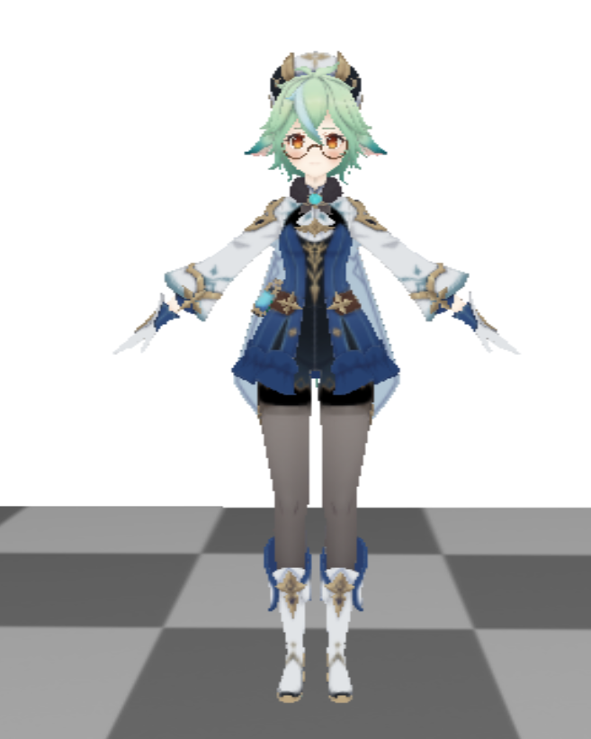

# Basic Filters

Filter can be applied after we draw the whole scene as a kind of postprocess. To achieve it, we need to provide a color texture on a framebuffer, so that the shader can draw on it and we then attach it on the filter shader.

## Shaders

The shader that draws the whole scene normally is omitted; we talk about the filter shader.

+ The easiest is grayscale filter and inversion filter, which blend RGB to gray/ invert the color. We just need to sample the color of texture by `texture(colorTexture, TexCoords).xyz`.

  ```glsl
  #version 330 core
  
  out vec4 FragColor;
  
  in vec2 TexCoords;
  
  uniform sampler2D colorTexture;
  uniform int filterOption;
  
  float GrayScale(vec3 color)
  {
      return 0.2126 * color.r + 0.7152 * color.g + 0.0722 * color.b;
  }
  
  // grayscale: vec3(GrayScale(texture(colorTexture, TexCoords).xyz));
  // inversion: vec3(1.0) - texture(colorTexture, TexCoords).xyz;
  ```

+ For Gaussian filter, we need to do weighted sum around the sample center. Here we just sample with one padding, with the coefficient $\propto e^{-(x-\mu)^2/2\sigma^2}$. For simplicity, we see the padding with the same coefficient $e^{-1/\sigma^2}$(in fact distance with corner ones are "longer" than up/down/left/right, but we see them as same).

  So the gaussian filter is like:

  ```glsl
  uniform float xOffset;
  uniform float yOffset;
  uniform	float pixelSigmaSqr;
  
  vec2 offsets[9] = vec2[](
          vec2(-xOffset,  yOffset), // 左上
          vec2( 0.0f,    yOffset), // 正上
          vec2( xOffset,  yOffset), // 右上
          vec2(-xOffset,  0.0f),   // 左
          vec2( 0.0f,    0.0f),   // 中
          vec2( xOffset,  0.0f),   // 右
          vec2(-xOffset, -yOffset), // 左下
          vec2( 0.0f,   -yOffset), // 正下
          vec2( xOffset, -yOffset)  // 右下
      );
  
  vec3 GaussianFilter()
  {
      // assume gaussian_sigma^2 = 0.5;
      float coeff = exp(-1 / pixelSigmaSqr);
      vec3 color = vec3(0.0);
      for(int i = 0; i < 4; i++)
      {
          color += texture(colorTexture, TexCoords + offsets[i]).xyz * coeff;
      }
      color += texture(colorTexture, TexCoords).xyz;
      for(int i = 5; i < 9; i++)
      {
          color += texture(colorTexture, TexCoords + offsets[i]).xyz * coeff;
      }
      color = color / (coeff * 8 + 1);
      return color;
  }
  ```

  Note that `xOffset/yOffset` is just reciprocal of `width/height` of screen, as delta of sampling around.

+ For joint bilateral filter, we need to consider more coefficients into weight, including depth and color. When the gap of depth/color is large, the weight will be low so that the edge can be preserved while inner part is filtered. This is common techinque of RTRT, too.

  ```glsl
  uniform	float depthSigmaSqr;
  uniform	float colorSigmaSqr;
  
  vec3 JointBilateralFilter()
  {
      vec3 color = vec3(0.0);
      vec3 weightSum = vec3(0.0);
  
      float coeff1 = -1 / pixelSigmaSqr, coeff2 = -1 / (2 * depthSigmaSqr),
          coeff3 = -1 / (2 * colorSigmaSqr);
      vec3 centerColor = texture(colorTexture, TexCoords).xyz;
      float centerDepth = texture(depthTexture, TexCoords).x;
      for(int i = 0; i < 4; i++)
      {
          vec2 currCoord = TexCoords + offsets[i];
          vec3 currColor = texture(colorTexture, currCoord).xyz;
          float currDepth = texture(depthTexture, currCoord).x;
          vec3 weight = exp(coeff1 + abs(centerDepth - currDepth) * coeff2 + 
              abs(centerColor - currColor) * coeff3);
          color += currColor * weight;
          weightSum += weight;
      }
      color += centerColor;
      for(int i = 5; i < 9; i++)
      {
          vec2 currCoord = TexCoords + offsets[i];
          vec3 currColor = texture(colorTexture, currCoord).xyz;
          float currDepth = texture(depthTexture, currCoord).x;
          vec3 weight = exp(coeff1 + abs(centerDepth - currDepth) * coeff2 + 
              abs(centerColor - currColor) * coeff3);
          color += currColor * weight;
          weightSum += weight;
      }
      color = color / (weightSum + 1);
      return color;
  }
  ```

+ Sobel detector: sobel detector is used for edge detection; it basically utilize the property that color will hugely change around edge, so it'll try to compare color difference. For horzitonal difference, it's like:

  ```glsl
  float Gx[9] = float[](
      1, 0, -1,
      2, 0, -2,
      1, 0, -1
  );
  ```

  If the total texture has the same color, then weighted sum will be 0; if left is background while right is the model, then the weighted color will be apparent.

  ```glsl
  vec3 SobelDetector()
  {
      vec3 sampleTex[9];
      for(int i = 0; i < 9; i++)
          sampleTex[i] = texture(colorTexture, TexCoords + offsets[i]).xyz;
  
      vec3 xColor = vec3(0.0);
      vec3 yColor = vec3(0.0);
      for(int i = 0; i < 9; i++)
      {
          xColor += Gx[i] * sampleTex[i];
          yColor += Gy[i] * sampleTex[i];
      }
      return sqrt(xColor * xColor + yColor * yColor);
  }
  ```

  Usually sobel detector will make edge white while others black, so we also filter it by grayscale. Here we use the color texture to filter, but in fact sobel detector usually be applied on grayscale picture, which means you can also grayscale it first and apply sobel filter on it next. You can also utilize the depth buffer, since the depth usually changes when edge appears.

## Color Texture For Framebuffer

As we've said, we need to render the whole scene on the framebuffer and apply filter on it; depth buffer itself is obviously not enough, and what we need is RGB color buffer. So we prepare the depth buffer like this:

```c++
const auto depthConfig = Core::TextureParamConfig{
    .wrapS = Core::TextureParamConfig::WrapType::ClampToEdge,
    .wrapT = Core::TextureParamConfig::WrapType::ClampToEdge
};	// To eliminate top grey shadow in filter.
Core::Framebuffer buffer{ width, height, depthConfig };
```

It seems that we don't specify color buffer; but it's in fact default argument, i.e. the last one will be `{ c_colorTextureDefaultConfig_ }` by default. We also slightly adjust configuration of depth buffer texture.

Then, when attaching textures, we can use `GetColorBuffer()`:

```c++
quadOnScreen.Draw(basicQuadShader,
                  [&buffer](int textureBeginID, const Core::Shader& shader) {
                      Core::Texture::BindTextureOnShader(
                          textureBeginID, "colorTexture",
                          shader, buffer.GetColorBuffer());
                      Core::Texture::BindTextureOnShader(
                          textureBeginID + 1, "depthTexture",
                          shader, buffer.GetDepthBuffer());
                  }, nullptr);
```

## Resize Framebuffer

Some platforms may have problems if we resize the attached texture/buffer in the framebuffer, so we need to regenerate a framebuffer if we want to resize it. Just like this:

```c++
const auto [width, height] = mainWindow.GetWidthAndHeight();
if (width != buffer.GetWidth() || height != buffer.GetHeight())
    buffer = Core::Framebuffer{ width, height, depthConfig };
```

Notice that the resizing is not obligated, since it just represents the granularity of sampling. However, if they're in different size, you need to manually reset the viewport like this:

```c++
// When drawing framebuffer
glViewport(0, 0, buffer.GetWidth(), buffer.GetHeight());
// When drawing on screen, [width, height] = mainWindow.GetWidthAndHeight();
glViewport(0, 0, width, height);
basicQuadShader.SetFloat("xOffset", 1.0f / width);
basicQuadShader.SetFloat("yOffset", 1.0f / height);
```

> You may think why we don't use width&height of framebuffer for offsets, and try it yourself.

What you get is a little bit mosaic if you maximize the window:



After this doc, you can fully understand what we do by reading the source code in `examples/BasicFilters.cpp`.