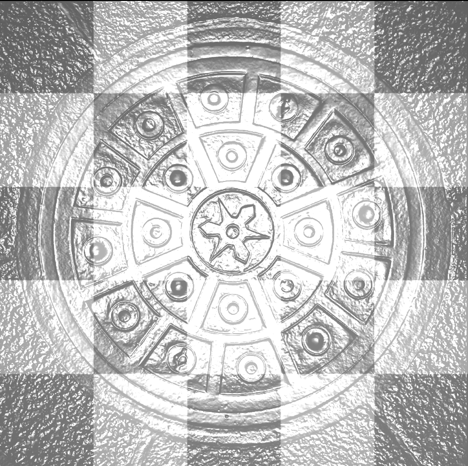

# Normal Map

Normal map is a technique that can boost the detail of mesh even if the mesh itself is simple, which will reduce the complexity of storage and rendering. For example, our simple checkerboard floor can be transformed magically after applying it:



In this section, we'll tell you how to achieve that.

## TBN

Normal map is just a texture that embeds normal in sphere with radius of 1 to a cube in RGB space $[0,1]^3$ by $(r,g,b)=f(x,y,z)=((x+1)/2,(y+1)/2,(z+1)/2)$. Vertices have already owned its normal in model space, e.g. as we record in `vn` in wavefront obj file. So, the easiest way is to record the transformed normal in model space, and you may get a colorful normal map. However, considering a cube with six facets with the same normal transformation; you have to record 6 normal maps, since they are rotated 90 degrees. Anyway, any transformation on the model itself will influence the normal map, which hurts the reusability.

Instead, we might as well record the "normal transformation", so that we can transform any model's normal with that transform. Some walls are rough, some rocks are rough, etc., and we may apply the same normal transformation on them. Mixing it with the original color texture will make them seemingly different!

To record the relative transformation, it's widely accepted to set the original normal as z axis, i.e. we see it $(0,0,1)$, and the normal applies some offsets on it. This is the reason why normal maps are usually strange blue: $(0,0,1)$ is transformed to $(0.5,0.5,1)$, so the blue component dominates. Also, we call this space **tangent space**, since we choose normal as an axis, just like constructing on the tangent plane(you may think the meaning of derivation of a 3D function).

To determine the exact coordinate, we also need an x and y axis. Considering that we'll sample on the texture, we might as well choose a triangle that includes this vertex, and use the unit vectors on the textures as two axes. For example:


Here we hope to calculate new axes for `A`, choose a triangle  `ABC`. They are mapped on the texture as `A'B'C'`. We use `u` and `v` as two new axes. However, we don't know their coordinates in the model space, so we need to transform the plane back from the texture space to the model space. That is:
$$
AB=\Delta T_1U+\Delta B_1V\\
AC=\Delta T_2U+\Delta B_2V
$$
where $A'B'=(\Delta T_1,\Delta U_1),A'C'=(\Delta T_2, \Delta U_2)$. In this way, we can know what $u$ and $v$ represent(i.e. $U$ and $V$) in the model space. But the normal of vertex is usually not perpendicular with the triangle plane, so we still need **Schmidt orthogonalization**. Thus finally:
$$
T=\text{normalize}(U-(U\cdot N)N)\\
B=\text{normalize}(V-(V\cdot T)T-(V\cdot N)N)
$$
This is the real tangent space axes, with $T$ called tangent and $B$ called bitangent. New normal coordinate in tangent space is recorded in the normal map, so that $TBN \times \text{texture}(u,v)$ is the transformed normal in the model space.

## Shaders

Theoretically, transform normal to world space is equivalent to transform other vectors back to the tangent space. Mathematically, TBN is an orthogonal mapping, which is a conformal transformation and distance-preserving transformation, thus distances and angles are just same; intuitively, TBN is just a linear transformation that changes a coordination, which will not in fact change the original distances!

Then why not just transform normal? That's because if we pass a `mat3 TBN` to fragment shader, interpolation will happen to average vertex attributes, so new `TBN` is not orthogonal. It's needed to apply Schmidt orthogonalization again. However, fragment shader is usually more expensive than vertex shader, so it's a better choice to do it in the second way.

Thus, the vertex shader is like:

```glsl
#version 330 core
layout(location = 0) in vec3 aPos;
layout(location = 1) in vec3 aNormal;
layout(location = 2) in vec2 aTexCoords;
layout(location = 3) in vec3 aTangent;
layout(location = 4) in vec3 aBiTangent;

out vec2 TexCoords;
out vec3 TangentLightPos;
out vec3 TangentFragPos;
out vec3 TangentViewPos;

uniform mat4 model;
uniform mat4 view;
uniform mat4 projection;
uniform vec3 lightPos;
uniform vec3 viewPos;

void main()
{
    TexCoords = aTexCoords;
    gl_Position = projection * view * model * vec4(aPos, 1.0);

    mat3 normalMatrix = transpose(inverse(mat3(model)));
    vec3 T = normalize(normalMatrix * aTangent);
    vec3 B = normalize(normalMatrix * aBiTangent);
    vec3 N = normalize(normalMatrix * aNormal);    

    mat3 invTBN = transpose(mat3(T, B, N));
    TangentFragPos = invTBN * vec3(model * vec4(aPos, 1.0));
    TangentLightPos = invTBN * lightPos;
    TangentViewPos = invTBN * viewPos;
    return;
}
```

Notice that each vertex has its unique TBN, so uniform variable will be an `out` variable. In fragment shader, we just need to get the normal in the tangent space by:

```glsl
vec3 normal = vec3(texture2D(normalMap, TexCoords));
normal = normalize(normal * 2.0 - 1.0);
```

Then we can operate on normal as we've done previously. We need lighting to utilize the normal so that the influence can be seen; here we just use Blinn-Phong shading with specular item to show it.

## Extended vertex attributes

Thanks to assimp, we can get tangent and bitangent by designating postprocess. We provide it by adding `true` as the third parameter of `BasicTriRenderModel`.

> Notice that this parameter is not guaranteed to be maintained in the future versions, since we hope to make users to control postprocess instead of limiting them by `bool` here.

Besides, we only provide `BasicVertexAttribute`, which has only normal and texture coordinates. More vertex attributes are needed for vertex shader!

Of course, we can provide as many attributes as possible so that you can use it once you need it; but it's a waste of time for more process and a waste of space for more redundant attributes. Instead, our framework provides a very convenient interface for customized vertex attributes, which surpasses many other frameworks. In this case, you just need to define like:

```c++
struct VertAttribWithTan
{
	glm::vec3 normalCoord;
	glm::vec2 textureCoord;
	glm::vec3 tanCoord;
	glm::vec3 bitanCoord;
};

BEGIN_REFLECT(VertAttribWithTan)
REFLECT(1, float, normalCoord) // layout, primitive type, name
REFLECT(2, float, textureCoord)
REFLECT(3, float, tanCoord)
REFLECT(4, float, bitanCoord)
END_REFLECT(4) // max considered layout.
```

Then we'll bind attributes for you automatically!

> + Note1: You can make layout non-consecutive, as long as `END_REFLECT` will include them all.
> + Note2: Layout begins at 1 since 0 always binds the position; providing `0` will be omitted.
> + Note3: These three macros need to be defined in global namespace; If your attribute struct is defined in another namespace, you need to write the complete name.

Besides, to copy them from assimp, you need to define a function:

```c++
// STILL needs to define in global namespace!
VERTEX_ATTRIB_SPECIALIZE_COPY(
    std::vector<VertAttribWithTan>& verticesAttributes_, const aiMesh* mesh)
{
	verticesAttributes_.resize(mesh->mNumVertices);
	for (size_t id = 0; id < verticesAttributes_.size(); id++)
	{
		auto& dstVertAttribute = verticesAttributes_[id];
		Core::CopyAiVecToGLMVec(mesh->mNormals[id],
                                dstVertAttribute.normalCoord);

		if (auto srcTextureCoords = mesh->mTextureCoords[0]) [[likely]]
			Core::CopyAiVecToGLMVec(srcTextureCoords[id],
                                    dstVertAttribute.textureCoord);
		else
			dstVertAttribute.textureCoord = { 0.f, 0.f };

		Core::CopyAiVecToGLMVec(mesh->mTangents[id],
                                dstVertAttribute.tanCoord);
		Core::CopyAiVecToGLMVec(mesh->mBitangents[id],
                                dstVertAttribute.bitanCoord);
	}
	return;
}
```

After these, you can pass your container in the model:

```c++
Core::BasicTriRenderModel floor{ path,
                                std::vector<VertAttribWithTan>{}, true };
```

> Any consecutive containers are fine, e.g. `std::static_vector` in C++26 or your customized container, as long as they're tag as `contiguous_tag`. It's recommended to pass into an empty container, and you're required to resize it in the copy function.

With all these hints, you can fully understand what the program does by reading the source code yourself! You can also try to apply the normal map on the Sucrose model(or any other model you like) by changing the configuration to see what happens. You may also need to adjust the camera and the light to get better result.